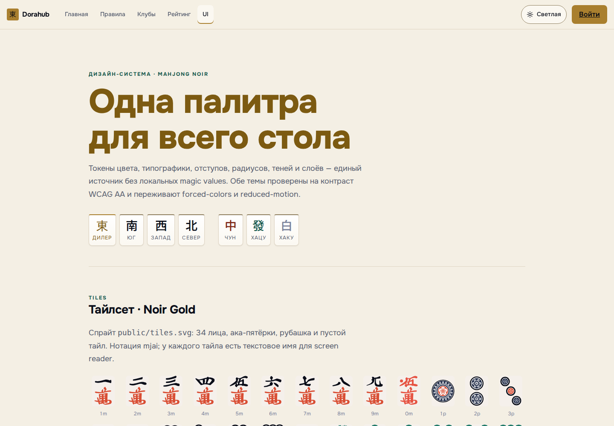
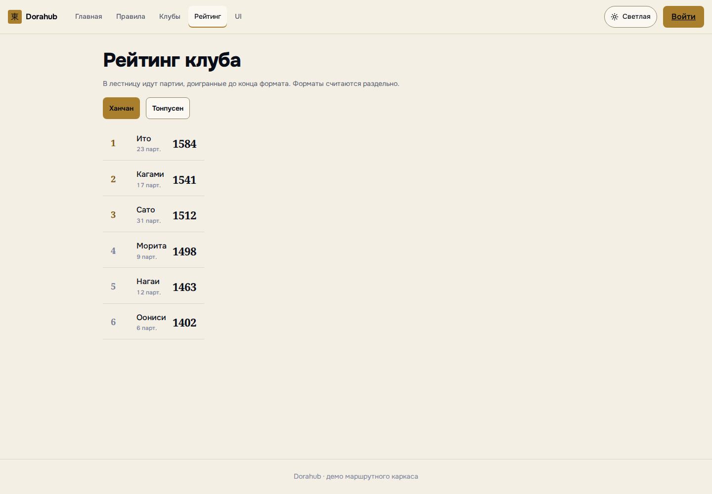

# Dorahub

Веб-приложение для офлайн-партий в риичи-маджонг: ведёт стол, считает очки,
сохраняет историю и обновляет рейтинг игроков. Фото-распознавание развивается
отдельно и не блокирует ручной ввод партии.



## Что уже работает

- passwordless-вход по email; Telegram OIDC, VK ID и TOTP на backend;
- ханчан и тонпусен по правилам RRC-RU;
- жеребьёвка мест, победы, ничьи, хонба, ставки риичи и итоговая ума;
- проверка яку, хан и фу через `mahjong-utils`, выплаты и поправки RRC-RU — в
  модуле `scoring`;
- оптимистическая блокировка стола, append-only журнал событий и откат раздачи;
- рейтинг Эло по местам, отдельно для каждого формата;
- React-интерфейс стола, профиля, рейтинга и панели метрик;
- экспериментальный Vision pipeline для детекции тайлов и геометрии стола.

Vision остаётся ассистентом: пользователь подтверждает результат, а партия
полностью проводится и без фотографии.

## Интерфейс



Компоненты, тайлсет, состояния и обе темы собраны на странице `/styleguide`.

## Быстрый старт

Нужны Docker и Docker Compose.

```bash
cp .env.example .env
docker compose up -d --build
```

Открыть <http://localhost:5173>. Снаружи опубликован только frontend; nginx
проксирует `/api/` на backend внутри Compose, поэтому cookie-сессия и CSRF
работают на одном origin. Порт меняется переменной `FRONTEND_PORT`.

В локальном профиле одноразовый код входа печатается в лог:

```bash
docker compose logs backend | grep 'код входа'
```

Создать готовый стол с четырьмя игроками:

```bash
./scripts/seed-local.sh
```

Скрипт при каждом запуске создаёт новый набор локальных аккаунтов и выводит
ссылку на стол вместе с email первого игрока.

Остановить окружение:

```bash
docker compose down
```

Данные PostgreSQL сохраняются в volume. Полный сброс локальной базы —
`docker compose down -v`.

## Разработка

### Backend

Java 25. Интеграционные тесты используют Testcontainers, поэтому Docker должен
быть запущен.

```bash
./gradlew :backend:check
./gradlew :backend:bootRun --args='--spring.profiles.active=local'
./gradlew :backend:spotlessApply
```

### Frontend

Node.js 22.

```bash
cd frontend
npm ci
npm run dev
npm run check
```

`npm run check` запускает lint, typecheck, Vitest, проверку OpenAPI-контракта,
motion-границ и production build.

### Vision

Базовые тесты не требуют весов и внешних ML-зависимостей:

```bash
PYTHONPATH=vision/src python3 -m unittest discover -s vision/tests
python3 -m json.tool contracts/vision/vision-result.schema.json >/dev/null
```

Запуск детектора, обучение и формат датасета описаны в
[vision/README.md](vision/README.md) и [vision/TRAINING.md](vision/TRAINING.md).

## Устройство репозитория

| Каталог | Назначение |
| --- | --- |
| `backend/` | Spring Boot, PostgreSQL, Flyway, accounts, rules, scoring, tables и ratings |
| `frontend/` | React PWA, Noir Gold UI и сгенерированный OpenAPI client |
| `vision/` | Python pipeline, обучение и метрики детектора |
| `contracts/` | OpenAPI, JSON Schema событий, Vision и rulesets |
| `infra/` | Текущее окружение и границы инфраструктуры |
| `scripts/` | Локальные служебные команды |
| `docs/adr/` | Принятые архитектурные решения |

Backend — модульный монолит. Состоянием партии владеет агрегат `Table`; запись
состояния и события выполняется одной транзакцией. Общие форматы сначала
меняются в `contracts/`, после чего обновляются producer и consumer.

## Контракты и решения

- [работа с контрактами](contracts/README.md);
- [локальная инфраструктура](infra/README.md);
- [ADR-0001: monorepo](docs/adr/0001-monorepo.md);
- [ADR-0002: анимационный стек](docs/adr/0002-hybrid-motion.md);
- [ADR-0003: расчёт очков](docs/adr/0003-score-engine-library.md);
- [Vision pipeline](vision/PIPELINE.md), [обучение](vision/TRAINING.md),
  [метрики](vision/METRICS.md) и [upstream-код](vision/UPSTREAM.md);
- [лицензии frontend-ассетов](frontend/ASSETS_LICENSE.md).

## Что пока не входит в MVP

- клубы, сезоны, формальные жалобы и окно оспаривания;
- чомбо, множественный рон, пао, санма и EMA ruleset;
- турниры и realtime-доставка через SSE;
- автоматическое подтверждение результата Vision без человека;
- production-инфраструктура до выбора провайдера.

Секреты, закрытые датасеты и веса моделей в Git не добавляются.
